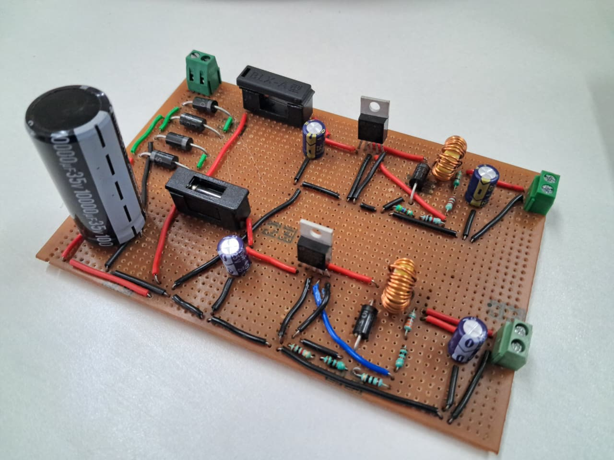
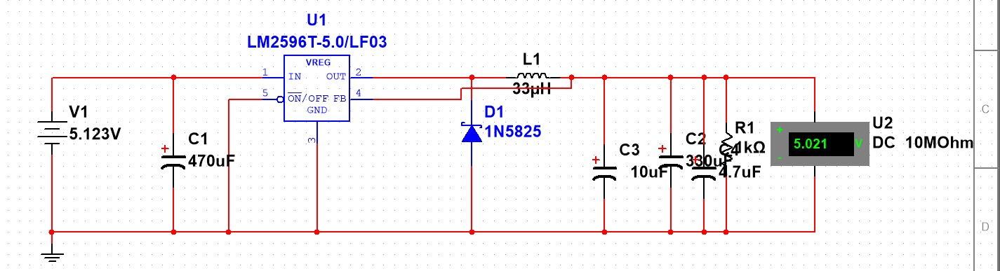
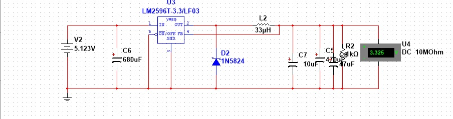

# ESP32 Smart Automation — Regulated AC to DC Multi-Voltage Power Supply

A custom-designed regulated power supply that converts **230V AC mains** into stable **5V and 3.3V DC** outputs for ESP32-based smart automation systems (water tank management, irrigation control, etc.).

> **Total BOM Cost: ~₹583** | **Efficiency: 88–90%** | **Ripple: <30 mV**

---

## Hardware



*Assembled prototype — 230V AC to 5V & 3.3V regulated DC*

---

## Simulation Results

| 5V Output Rail | 3.3V Output Rail |
|:--------------:|:----------------:|
|  |  |

---

## Demo Video

▶️ [`output_video_5v and 3.3v.mp4`](output_video_5v%20and%203.3v.mp4) — Live measurement of both regulated outputs under load.

---

## Why This Project Exists

Off-the-shelf USB adapters and chargers fail in 24/7 automation scenarios because:

- They provide only one voltage rail
- They introduce electrical noise → sensors misread
- Voltage sags during ESP32 WiFi transmission → random controller resets
- They lack proper isolation from 230V AC (safety risk outdoors)

This project builds a **dedicated dual-rail power supply** that separates:
- **5V rail** → Relay modules, ultrasonic sensors
- **3.3V rail** → ESP32 controller, soil moisture sensors

---

## Key Specifications

| Parameter | Value |
|-----------|-------|
| AC Input | 230V, 50Hz |
| DC Output 1 | 5V @ 2A |
| DC Output 2 | 3.3V @ 1A |
| Ripple Voltage | < 30 mV (3.3V rail) |
| Regulation IC | LM2596-ADJ (×2) |
| Efficiency | 88–90% |
| Isolation | Transformer-based galvanic isolation |

---

## System Overview

```
230V AC → Step-Down Transformer → Bridge Rectifier (SR560)
       → Filter Capacitors (10,000 µF)
       → LM2596 Buck #1 → 5V Rail  → Relays, Ultrasonic Sensor
       → LM2596 Buck #2 → 3.3V Rail → ESP32, Soil Moisture Sensor
```

Full block diagram and flowchart: [`docs/03-system-design.md`](docs/03-system-design.md)

---

## Repository Structure

```
esp32-power-supply/
├── README.md                         ← You are here
│
├── 5v_simulation.jpeg                ← 5V buck converter simulation output
├── 3v3_simulation.jpeg               ← 3.3V buck converter simulation output
├── hardware_220_to_5v&3v3.jpeg       ← Hardware prototype photo
├── output_video_5v and 3.3v.mp4      ← Live demo video
│
├── PowerSupply.ms14                  ← Main Multisim simulation (full circuit)
├── transformer_220v_9v.ms14          ← Transformer stage simulation
├── 220v_to_3v3_short_ckt_protection.ms14  ← Short circuit protection sim
│
├── ki_cad_pcb_power_supply/          ← KiCad PCB design files
├── datasheet/                        ← Component datasheets (LM2596, SR560, etc.)
│
├── docs/
│   ├── 01-introduction.md            ← Problem statement, motivation, objectives
│   ├── 02-literature-survey.md       ← Power supply topology review
│   ├── 03-system-design.md           ← Block diagram, flowchart, design decisions
│   ├── 04-calculations.md            ← Full component-level math
│   ├── 05-results.md                 ← Simulation + hardware results
│   └── 06-future-scope.md            ← Planned improvements
│
├── hardware/
│   ├── bom.md                        ← Bill of Materials with costs
│   └── component-selection.md        ← Why each component was chosen
│
├── simulation/
│   └── README.md                     ← How to open and run the .ms14 files
│
├── images/                           ← Additional diagrams and screenshots
├── LICENSE
```

---

## Quick Results

| Test Point | Measured Value |
|------------|---------------|
| Transformer Secondary Output | ~14.1V AC |
| Rectified DC (after filter) | ~16V DC |
| Buck Converter Output 1 | **5.02V DC** |
| Buck Converter Output 2 | **3.31V DC** |
| Ripple (3.3V rail) | **< 30 mV** |
| Max Load (5V rail) | 2A stable |
| ESP32 WiFi peak handling | 250–500 mA, no resets |

---

## PCB Design

KiCad schematic and PCB layout files are in [`ki_cad_pcb_power_supply/`](ki_cad_pcb_power_supply/).
Open with **KiCad 9.0+**.

---

## Simulation Files

All simulations were built in **NI Multisim**. Open the `.ms14` files in Multisim 14+:

| File | What It Simulates |
|------|------------------|
| [`PowerSupply.ms14`](PowerSupply.ms14) | Full circuit — transformer → rectifier → both buck converters |
| [`transformer_220v_9v.ms14`](transformer_220v_9v.ms14) | Transformer stage only (220V → 9V AC) |
| [`220v_to_3v3_short_ckt_protection.ms14`](220v_to_3v3_short_ckt_protection.ms14) | Short circuit protection on 3.3V rail |

See [`simulation/README.md`](simulation/README.md) for setup instructions.
---
## License

MIT License — see [`LICENSE`](LICENSE)
